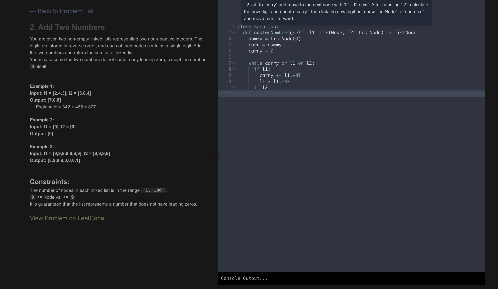

# LeetCode Tutor  

## Features  

- **Code Editor**: Write and test your code with python in the browser (pyodide)
- **AI Hints**: Get a quick, single-step hint when you're stuck using **`CMD + Shift + H`**.  
- **Chat Window**: Ask ChatGPT for hints or help in a floating chat box. Open it with **`CMD + Shift + '`**.  
- **Solutions**: Has solutions to all LC problems

## Preview  
  

todo:
figure out how to embed python tutor

snippets/python guide section
